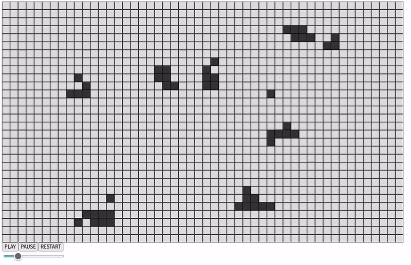

# El Juego de la Vida en p5.js

Este proyecto implementa el famoso "Juego de la Vida" de John Conway utilizando la biblioteca p5.js.

## Estructura del Proyecto

- `index.html`: Archivo principal HTML que carga el script de p5.js y los archivos JavaScript del proyecto.
- `clases.js`: Contiene las clases `Celula` y `Poblacion` que representan las células individuales y la población de células, respectivamente.
- `sketch.js`: Contiene las funciones `setup` y `draw` de p5.js, así como la lógica para la interacción del usuario.
- `p5.min.js`: Biblioteca p5.js.
- `README.md`: Este archivo.

## Uso

1. Abre `index.html` en un navegador web.
2. Usa los botones "PLAY", "PAUSE" y "RESTART" para controlar el juego.
3. Ajusta la velocidad del juego con el control deslizante.

## Requisitos

- [p5.js](https://p5js.org/)

## Autor

- Mario Roos Hoefgeest Toribio
